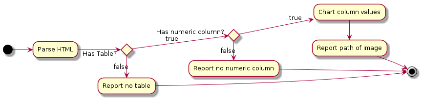

# Chart URL Table

## Continuous Integration

[]()

https://app.shippable.com/github/svo/chart-url-table/dashboard

## Solution Design

### Decisions

* using ruby as wanting to build familiarity to aid feasibility analysis on a marketplace implementation
* command line interface is sufficient
* if more than one table in the document it will just use the first
* if more than one column in the table it will just use the first
* column values are expected to be consistent i.e. either all quoted or unquoted

### Activity



## Development

### Setup (Docker)

```
docker login
vagrant up docker
vagrant ssh docker
```

### Setup (VirtualBox)

```
vagrant up virtualbox
vagrant ssh virtualbox
```

### Setup (Both VirtualBox and Docker)

```
docker login
vagrant up
vagrant ssh [docker | virtualbox]
```

### Running Tests

#### Using Vagrant

```
vagrant ssh [docker | virtualbox]
cd /vagrant
./bash/test.sh
```

#### Using Docker Build Image

```
./test.sh
```

## Configuration Management

### Create Development Docker Image

Created using ansible playbook: `configuration-management/ansible/playbook-development.yml`

```
vagrant ssh [docker | virtualbox]
cd /vagrant
./bash/create-development.sh
```

### Create Build Docker Image

Created using ansible playbook: `configuration-management/ansible/playbook-buildnode.yml`

```
vagrant ssh [docker | virtualbox]
cd /vagrant
./bash/create-buildnode.sh
```
